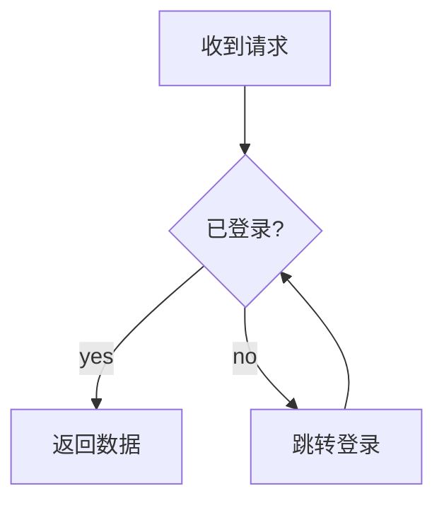
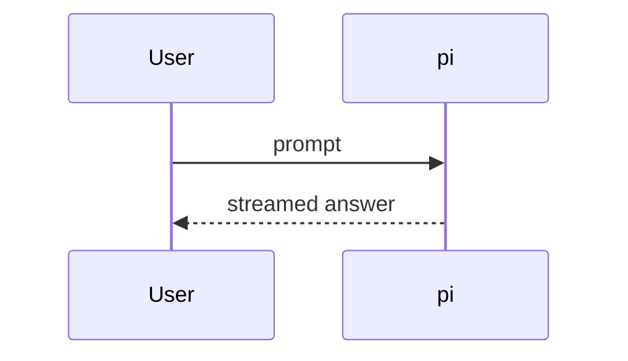
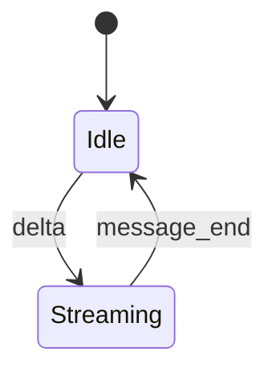
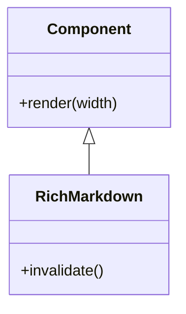
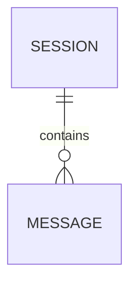
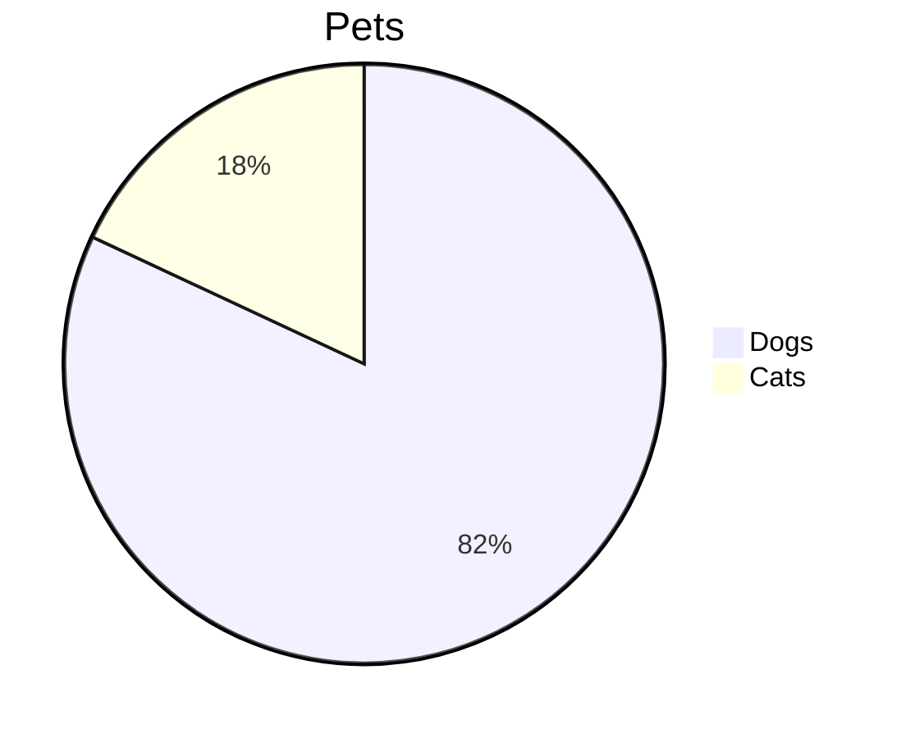

## Flowchart

```mermaid
graph TD
  A[收到请求] --> B{已登录?}
  B -->|yes| C[返回数据]
  B -->|no| D[跳转登录]
  D --> B
```

## Sequence

```mermaid
sequenceDiagram
  participant U as User
  participant P as pi
  U->>P: prompt
  P-->>U: streamed answer
```

## State

```mermaid
stateDiagram-v2
  [*] --> Idle
  Idle --> Streaming: delta
  Streaming --> Idle: message_end
```

## Class

```mermaid
classDiagram
  Component <|-- RichMarkdown
  Component : +render(width)
  RichMarkdown : +invalidate()
```

## ER

```mermaid
erDiagram
  SESSION ||--o{ MESSAGE : contains
```

## Unsupported (falls back to code)

```mermaid
pie title Pets
  "Dogs" : 386
  "Cats" : 85
```
